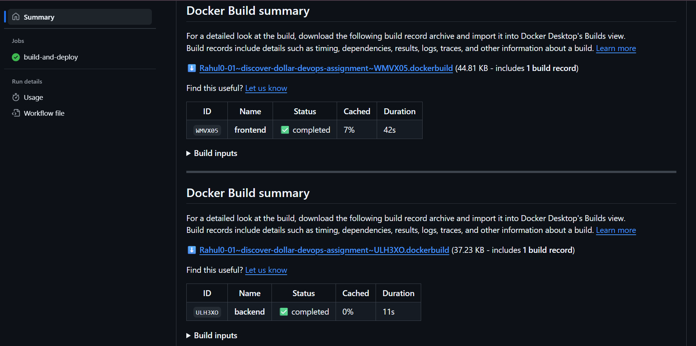
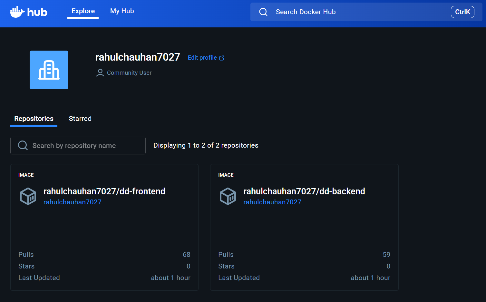
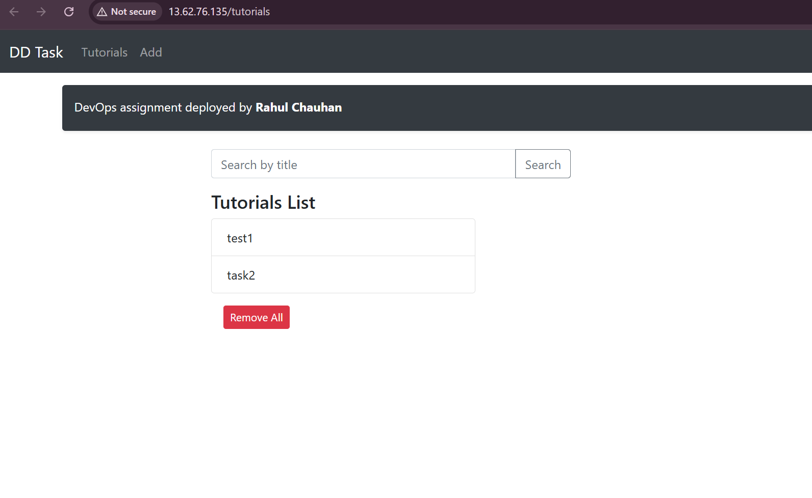

# Discover Dollar – DevOps Internship Assignment

End-to-end MEAN CRUD application deployed as part of the Discover Dollar DevOps evaluation.  
This repository demonstrates containerized microservices, GitHub Actions CI/CD, and production deployment on AWS EC2.

---

## Features & Tech Stack

### Product Features
- Tutorials CRUD: create, list, edit, delete, bulk delete
- Search tutorials by title
- Publish/unpublish tutorial state
- UI banner: “Discover Dollar Tutorials Dashboard – DevOps assignment deployed by Rahul Chauhan.”

### Tech Stack
Backend: Node.js, Express, Mongoose, MongoDB driver, CORS/JSON middleware  
Frontend: Angular 15, RxJS, Bootstrap 4, Angular Router, HttpClient  
Database: MongoDB 6 (`dd_db`) via `MONGODB_URI`  
Infra/DevOps: Docker, Docker Compose, Nginx reverse proxy, GitHub Actions, AWS EC2, SSH deploy

---

## Architecture Overview

High-level flow:

Browser → Nginx (frontend container) → Backend container → MongoDB container

### Container Roles
- **Frontend container (Nginx)**  
  - Serves Angular build from `/usr/share/nginx/html`  
  - Proxies `/api` → backend:8080  

- **Backend container**  
  - Express app on port 8080  
  - Reads `MONGODB_URI`  
  - Defaults to: `mongodb://localhost:27017/dd_db`  

- **Mongo container**  
  - mongo:6 image  
  - Persistent volume: `mongo_data`  

All services share the default Docker network.

---

## Local Development (Without Docker)

### Backend (Node.js)
```bash
cd backend
npm install
node server.js
```

Runs on: http://localhost:8080  
MongoDB config:  
`process.env.MONGODB_URI || "mongodb://localhost:27017/dd_db"`

### Frontend (Angular)
```bash
cd frontend
npm install
npm run start -- --port 8081
```

Runs on: http://localhost:8081

Environment files:  
- environment.ts → apiUrl: 'http://localhost:8080/api'  
- environment.prod.ts → apiUrl: '/api'  

---

## Dockerized Setup (Local)

### Dockerfiles
- backend/Dockerfile: Node 18 Alpine, exposes 8080  
- frontend/Dockerfile: Node builder + Nginx, exposes 8081 internally  

### docker-compose.yml Services
- mongo (27017 exposed)  
- backend (8080 exposed)  
- frontend (host 80 → container 8081)  

### Commands
```bash
docker compose up -d
docker compose ps
docker compose logs -f
docker compose down
```

Access UI: http://localhost  
MongoDB data persists in `mongo_data`.

---

## Production Deployment (AWS EC2 + docker-compose.prod.yml)

Uses prebuilt Docker Hub images:
- Backend: rahulchauhan7027/dd-backend:latest  
- Frontend: rahulchauhan7027/dd-frontend:latest  

### Steps (EC2 Ubuntu)
```bash
ssh -i your-key.pem ubuntu@<EC2_PUBLIC_IP>
sudo apt-get update && sudo apt-get install -y docker.io docker-compose-plugin
sudo usermod -aG docker $USER
newgrp docker

git clone https://github.com/Rahul0-01/discover-dollar-devops-assignment.git
cd discover-dollar-devops-assignment

sudo docker compose -f docker-compose.prod.yml up -d
```

App URL: http://<EC2_PUBLIC_IP>/

---

## CI/CD Pipeline (GitHub Actions)

Workflow: `.github/workflows/deploy.yml`  
Triggers:
- push to main  
- workflow_dispatch  

### Steps
- Checkout repo  
- Login to Docker Hub  
- Build & push backend + frontend images  
- SSH into EC2 and deploy  

### Secrets Required
- DOCKERHUB_USERNAME  
- DOCKERHUB_TOKEN  
- EC2_HOST  
- EC2_USER  
- EC2_SSH_KEY  

---

## Nginx Reverse Proxy (frontend/nginx.conf)

```nginx
server {
    listen 8081;
    root /usr/share/nginx/html;
    index index.html;

    location / {
        try_files $uri $uri/ /index.html;
    }

    location /api {
        proxy_pass http://backend:8080;
        proxy_set_header Host $host;
        proxy_set_header X-Real-IP $remote_addr;
    }
}
```

Benefits:  
- SPA routing via try_files  
- Same-origin API → no CORS  
- Clean /api backend access  

---

## How to Reproduce End-to-End

### Option A – Docker (Local)
```bash
docker compose up -d
open http://localhost
```

### Option B – AWS EC2
```bash
ssh -i key.pem ubuntu@<EC2_PUBLIC_IP>
git clone https://github.com/Rahul0-01/discover-dollar-devops-assignment.git
cd discover-dollar-devops-assignment
sudo docker compose -f docker-compose.prod.yml up -d
```

---

## Screenshots

### 1. GitHub Actions CI/CD


### 2. Docker Hub images


### 3. Live UI with custom banner


---

## Troubleshooting

- Port 80/8080 in use → stop conflicting services  
- Image pull denied → check Docker Hub credentials  
- Mongo connection fails → verify network + MONGODB_URI  
- Nginx 502 → backend container not healthy  
- Angular wrong API → ensure production build uses `/api`  

---

## Conclusion

This assignment by **Rahul Chauhan** demonstrates:
- Modular MEAN architecture  
- Multi-stage Docker builds  
- Automated CI/CD  
- EC2 production deployment  
- Nginx reverse proxy  
- Fully reproducible DevOps workflow  
